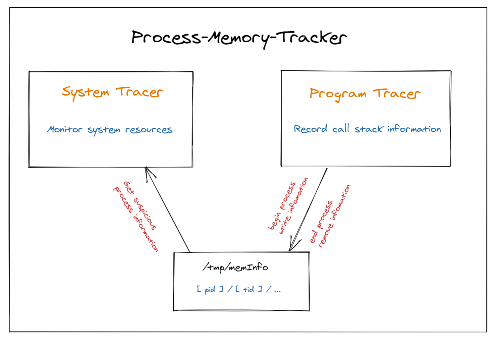

# Process-Memory-Tracker
## Introduction

This project has realized a memory leak detector for C/C++ programs which runs on Linux operating systems. The memory leak detection is mainly divided into two parts: The first part is **System Tracer**. It monitors the resource allocation of the entire system and catches suspicious memory leaking processes. The second part is **Program Tracer**. As the program runs, it records the function call stack of each dynamic allocation and release of memory, and saves it in the `/tmp/memInfo` folder. It will also determine whether there is a memory leak at the end of the program, and release all unreleased memory. When the **System Tracer** detects a suspicious memory leak process, the leak location can be printed through the `/tmp/memInfo` folder which was recorded by **Program Tracer**.

### Structure



### Dependent environment

- Ubuntu / CentOs

- `CXX_STANDARD` 11

#### Dependent library

- `build-essential`

- `cmake`

- `addr2line`

  

## System Memory Tracker

```shell
# Current path is "Process-Memory-Tracker/SystemTracker"
# Compile:
sudo g++ Task.h Task.cpp main.cpp -o SystemTracker -pthread -std=c++11

# Execute:
sudo ./SystemTracker
```

After  executing the memory leak program, you will have the following prompts:

```
Please enter the following number
1: Show memory info of all process
2: Show the current cpu usage
3: Detect file handle and memory change of the program with certain pid
4: Stop detecting file handle and memory change in 3
5: Get the called stack info of the program with certain pid
0: Exit!
```

Each number has its corresponding instruction.

### Option

- If choose number **5**, it will printed the leak location can be through the `/tmp/memInfo` folder which was recorded by **Program Tracer**. So at this time, there must be some process run with  **Program Tracer**

#### Run Program Tracer

- Set test of **Program Tracer**: modify `Process-Memory-Tracker/ProgramTracer/CMakeLists` file

```sh
# Change the test file: test/DockingTest.cpp is the test file.
add_executable(${PROJECT_NAME} test/DockingTest.cpp ${SRC_FILES} ${project_HEADERS})
```

- set up

```sh
# Current path is "Process-Memory-Tracker/ProgramTracer"
mkdir build
cd build
cmake ..
make

# Execute test file.
./ProgramTracer
```


## Program Tracker

### Structure

```
ProgramTracer
├── CMakeLists.txt
├── include
│   ├── FileManagement.h
│   ├── MemoryAllocationWrap.h
│   ├── StackTracerManagement.h
│   └── TracerSignal.h
├── build
├── Operation Manual.md
├── src
│   ├── FileManagement.cpp
│   ├── MemoryAllocationWrap.cpp
│   ├── StackTracerManagement.cpp
│   └── TracerSignal.cpp
├── test
│   ├── DockingTest.cpp
│   └── SimpleTest.cpp
├── tmp
└── tracerConfig.h.in
```

- `CMakeLists`: cmake config file
- `include`: Header folder of project **Program Memory Tracker**
- `src`: Source folder of project **Program Memory Tracker**
- `test`: Test folder of project **Program Memory Tracker**
- `tmp`: Sample output of `/tmp/memInfo` folder when **Program Memory Tracker** record information.
- `tracerConfig.h.in`: Configure a header file to pass some of the CMake settings.

### Set Up

```shell
# Current path is "Process-Memory-Tracker/ProgramTracer"
mkdir build
cd build
cmake ..
make

# Execute test file.
./ProgramTracer
```


### Configuration Parameter

Configure parameters in `CMakeLists` file.

```shell
# Set the output file location of the memory leak results; if you want the output to be in the console, then set(PATH \"\")
set(PATH \"leakInfo\")	

# Set whether it is DEBUG mode. In DEBUG mode, you can see the function call information. true is open DEBUG, false is close DEBUG.
set(DEBUG_BUILD true)

# Set up the test file: test/DockingTest.cpp is the test file.
add_executable(${PROJECT_NAME} test/DockingTest.cpp ${SRC_FILES} ${project_HEADERS})
```

### Debug Model

- Sample console output

```sh
===== malloc_test start =====                                                         call __wrap_malloc function, size: 64                                                 Malloc: 64                                                                             String = It's malloc_test. The str didn't leak.,  Address = 10166320                   call __wrap_malloc function, size: 64                                                 Malloc: 64                                                                             String = It's malloc_test. The str did leak.,  Address = 10168448                     call __wrap_free function                                                             Free: 64                                                                               ===== malloc_test finish =====                                                         MEMORY LEAK                                                                           call __wrap_free function                                                             Free: 64                                                                               rmd /tmp/memTracer/2616/
```


### Output

- `CMakeLists` file: set output file

```sh
# Set the output file location of the memory leak results; if you want the output to be in the console, then set(PATH \"\")
set(PATH \"leakInfo\")	
```

- `leakInfo`

```sh
Type: malloc
ID: 1
Time: Fri May 28 01:11:42 2021
PID: 2616, TID: 139866991499072
Size: 64
There are 8 messages: 
_ZN21StackTracerManagement16setAddrBacktraceERP12trace_record10trace_typePvm at /home/albert/win_share/Project/Process-Memory-Tracker/ProgramTracer/src/StackTracerManagement.cpp:34
_ZN21StackTracerManagement13insert_unlockE10trace_typePvm at /home/albert/win_share/Project/Process-Memory-Tracker/ProgramTracer/src/StackTracerManagement.cpp:79
_ZN21StackTracerManagement6insertE10trace_typePvm at /home/albert/win_share/Project/Process-Memory-Tracker/ProgramTracer/src/StackTracerManagement.cpp:93
__wrap_malloc at /home/albert/win_share/Project/Process-Memory-Tracker/ProgramTracer/src/MemoryAllocationWrap.cpp:15
_Z11malloc_testv at /home/albert/win_share/Project/Process-Memory-Tracker/ProgramTracer/test/SimpleTest.cpp:68
main at /home/albert/win_share/Project/Process-Memory-Tracker/ProgramTracer/test/SimpleTest.cpp:57
Can't parse message: /lib/x86_64-linux-gnu/libc.so.6(__libc_start_main+0xf0) [0x7f3551823840]
_start at ??:?

```


### Simple Test

The `SimpleTest.cpp` file contains the basic memory allocation examples. 

- `CMakeLists` file

```sh
# Change the test file: test/SimpleTest.cpp is the test file.
add_executable(${PROJECT_NAME} test/SimpleTest.cpp ${SRC_FILES} ${project_HEADERS})
```

- Choose test case in `test/SimpleTest.cpp`

```cpp
// Choose one of 8 test samples
int main() {
    malloc_test();
//    new_test();
//    new_array_test();
//    fopen_test();
//    freopen_test();
//    thread_test();
//    segfault_test();
//    infinite_test();
    return 0;
}
```

- Set up

```sh
# Current path is "Process-Memory-Tracker/ProgramTracer"
mkdir build
cd build
cmake ..
make

# Execute test file.
./ProgramTracer
```


## Citation

- [LeakTracer](https://github.com/fredericgermain/LeakTracer) gives me the idea of using **hashmap** class to manage data storage.
- [file-stack_traces-c](https://gist.github.com/jvranish/4441299#file-stack_traces-c) helps me lot about catching exceptions and printing stack traces in C.
- In `Program/FileManagement.cpp` function `createDirectory()`, I ues the code of [Create multi-level directories](https://blog.csdn.net/m0_37579176/article/details/105741164) in CSDN to help me create a folder directory.
- In `Program/FileManagement.cpp` function `getfilepath()` and `clearDirectory()`, I ues the code of [Delete all files in the folder](https://blog.csdn.net/sunshihua12829/article/details/45916225) in CSDN to help me clean up the folder directory.

